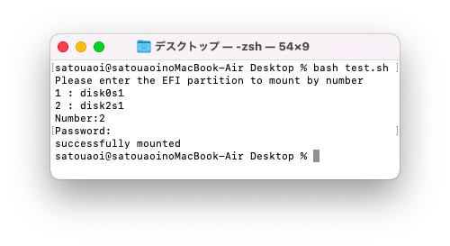

# MacOS-EFI-mounter

コマンドの知識無しでEFIパーティションを簡単にマウントすることができます
OpenCoreなどでEFIパーティションにデータを入れたい際に活用してくださいww

# 対応OS

MacOSのみ。BigSurで検証した際は動きました。


# 実行する前に

検証環境では問題なかったですが同一ボリューム名をパーティションをマウントするとデータが破損する可能性があります。
このスクリプトを実行したことによる故障や損害について開発者は責任を負いかねます

# 実行の仕方

OpenCoreなどを書き込みたいデバイスを接続します。

MacOSのターミナルを起動し以下コマンドを貼り付けて実行します
```sh
bash <(curl -s https://raw.githubusercontent.com/Aoi-Developer/MacOS-EFI-mounter/main/main.sh)
```
表示されたパーティションを番号で指定しEnterキーを押します。(disk0は大体OSがインストールされたデバイスです)
現在ログインしているユーザのパスワードを入力してEnterを押します。


